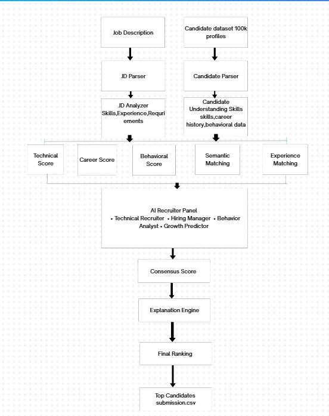

# AI Talent Engine – Intelligent Candidate Ranking System

## Overview

AI Talent Engine is an AI-powered hiring intelligence system designed to help recruiters identify the most suitable candidates from large talent pools.

Traditional hiring systems rely heavily on keyword matching, which often overlooks strong candidates who possess relevant experience but describe their work differently. This project addresses that problem by combining semantic understanding, experience intelligence, behavioral analysis, and multi-agent recruiter evaluation to generate trustworthy candidate rankings.

---
## System Architecture


---

## Problem Statement

Recruiters face three major challenges:

* Large candidate volumes make manual screening difficult.
* Keyword-based ATS systems often miss qualified candidates.
* Traditional ranking systems fail to consider career trajectory, behavioral signals, and contextual experience.

The goal of this project is to create an intelligent ranking system that understands both job requirements and candidate profiles to recommend the most suitable candidates.

---

## Our Solution

The system performs:

1. Job Description Understanding
2. Candidate Profile Analysis
3. Semantic Similarity Matching
4. Experience Intelligence Evaluation
5. Behavioral Signal Analysis
6. AI Recruiter Panel Evaluation
7. Explainable Candidate Ranking

The final output is a ranked shortlist of candidates along with reasoning that recruiters can trust.

---

## System Architecture

Job Description
↓
JD Parser
↓
JD Analyzer
↓
Requirement Extraction

Candidate Profiles
↓
Candidate Parser
↓
Profile Understanding

↓

Technical Evaluation
Career Evaluation
Behavioral Evaluation
Experience Intelligence

↓

Semantic Matching (Sentence Embeddings)

↓

AI Recruiter Panel

* Technical Recruiter
* Hiring Manager
* Behavioral Analyst
* Growth Predictor

↓

Consensus Score

↓

Explanation Engine

↓

Final Candidate Ranking

---

## Key Features

### Semantic Matching

Uses sentence embeddings to understand meaning beyond exact keyword matches.

Example:

Job Description:
"Experience building retrieval systems"

Candidate Resume:
"Designed search ranking infrastructure"

The system identifies these as semantically related.

---

### Experience Intelligence

Instead of only checking listed skills, the system analyzes what candidates have actually built and delivered.

Examples:

* Retrieval Systems
* Ranking Pipelines
* Recommendation Engines
* Production AI Applications

---

### Behavioral Intelligence

Evaluates recruiter interaction signals including:

* Recruiter Response Rate
* Interview Completion Rate
* Profile Activity
* Platform Engagement

---

### AI Recruiter Panel

The system simulates a real hiring committee through four independent evaluators:

#### Technical Recruiter

Evaluates technical fit.

#### Hiring Manager

Evaluates role relevance and project experience.

#### Behavioral Analyst

Evaluates hiring readiness.

#### Growth Predictor

Evaluates future potential and adaptability.

The final ranking is generated through recruiter consensus.

---

## Scoring Framework

Final ranking combines:

* Technical Score
* Career Score
* Behavioral Score
* Experience Intelligence Score
* Semantic Similarity Score
* Recruiter Panel Consensus

This hybrid approach improves ranking quality compared to traditional ATS systems.

---

## Example Output

Top Candidate:

Candidate ID: CAND_0002025

Role:
Senior AI Engineer

Highlights:

* Matches required experience range
* Built retrieval systems
* Worked on ranking pipelines
* Experience with vector databases
* Strong semantic alignment with job requirements

Recruiter Panel:

* Technical Recruiter: 96
* Hiring Manager: 94
* Behavioral Analyst: 82
* Growth Predictor: 78

Consensus Score: 87.5

---

## Technologies Used

* Python
* Sentence Transformers
* Scikit-learn
* NumPy
* Pandas
* JSONL Dataset Processing

---

## Repository Structure

```text
ai-talent-engine/

├── data/
├── outputs/
├── src/
│   ├── candidate_parser.py
│   ├── jd_parser.py
│   ├── jd_analyzer.py
│   ├── scoring.py
│   ├── ranking.py
│   ├── recruiter_panel.py
│   ├── explainer.py
│   └── output_generator.py
│
├── main.py
├── requirements.txt
└── README.md
```

---

## How To Run

Install dependencies:

```bash
pip install -r requirements.txt
```

Run the project:

```bash
python main.py
```

Output:

* Ranked Candidates
* Recruiter Panel Scores
* Candidate Explanations
* submission.csv

---

## Future Scope

* Resume Review Platform
* ATS Score Generation
* Career Path Recommendation
* Interview Readiness Analysis
* Personalized Skill Gap Detection
* AI Career Intelligence Platform

---

## Impact

AI Talent Engine transforms hiring from simple keyword matching into intelligent candidate understanding, helping recruiters identify high-potential talent more accurately and efficiently.
